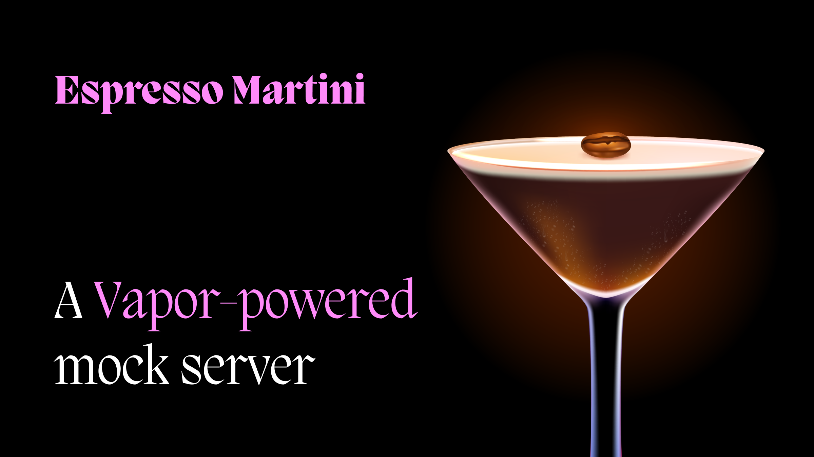

<p align="center">

</p>

[](https://twitter.com/inkedengineer)


# Espresso Martini

`Espresso Martini` is a vapor-powered mock server. It allows you you to mock HTTP requests easily, so you worry about the things that matter, and not have to wait on APIs to be live.

Just configure your request/response pairs, known as `NetworkExchange`, run the server, and you are good to go. Requests made to the configured hostname and port will be intercepted and the server will return any desired response.

It supports different types of data, response headers and all HTTP response codes. 

The library is fully tested and documented.

# 1. Requirements and Compatibility

- Xcode 13.2+
- Swift 5.6+
- iOS 13+
- macOS 12+

> When running on iOS you will get a threading warning, which is a [known issue](https://github.com/apple/swift-nio/issues/2223) with NIO and can be safely ignored.

# 2. Roadmap

- [x] Add support for folder based request/response pairs
- [x] Add support for a global delay
- [x] Add support for a delay on a per `networkExchange` basis
- [x] Add a CLI
- [ ] Add possibility to fetch the list of all corrupted endpoints
- [ ] Add possibility to fetch why an endpoint is corrupted
- [ ] Add support for customised response based on query parameters
- [ ] Add support for retry-able request

# 3. Installation

## Swift Package Manager

#### Package.swift

Open your `Package.swift` file and add the following as your dependency. 

```swift
dependencies: [
  .package(url: "https://github.com/TheInkedEngineer/Espresso-Martini", from: "1.0.0")
]
```

Then add the following to your target's dependency:

```swift
targets: [
  .target(
    name: "MyTarget", 
    dependencies: [
      .product(name: "https://github.com/TheInkedEngineer/Espresso-Martini", package: "Espresso-Martini")
    ]
  )
]
```

#### Xcode

1. Open your app in Xcode
1. In the **Project Navigator**, click on the project
1. in the Project panel, click on the project
1. Go to the **Package Dependencies** tab
1. Click on the `+` button
1. Insert the `https://github.com/TheInkedEngineer/Espresso-Martini` url in the search bar and press **Enter**
1. Click on the `Add Package` button
1. Follow the Xcode's dialog to install the SDK

## CLI

1. Clone the repo `git clone git@github.com:TheInkedEngineer/Espresso-Martini.git`
1. `cd Espresso-Martini`
1. `make` -- you might need to run it with `sudo` privileges.

# 4. Documentation

The code for `Espresso-Martini` is fully documented. An DocC documentation will follow :).

# 5. How to use

## As in-app package

- Start by importing the mock server using `import EMMockServer`
- Configure the mock server, either by using `SimpleConfigurationProvider` or creating your custom implementation of `ServerConfigurationProvider`
- call `run()`

> NOTE: When using with a sandboxed `macOS` application make sure the networking entitlements are turned on.

## CLI

- `espressomartini run` -- Runs the server with the list of all network exchanges.
  - `--configuration <file>` argument points to the name of the configuration file.
  - `--requests-folder <folder>` argument points to the name of the folder where the request reside. Defaults to `networkExchanges`.
- `espressomartini endpoints` -- Fetches the list of all the endpoints
  - `--requests-folder <folder>` argument points to the name of the folder where the request reside. Defaults to `networkExchanges`. 
  - `--verbose` flag add details around the response to the list of endpoints

# 6. Contribution

**Working on your first Pull Request?** You can learn how from this *free* series [How to Contribute to an Open Source Project on GitHub](https://egghead.io/series/how-to-contribute-to-an-open-source-project-on-github)
